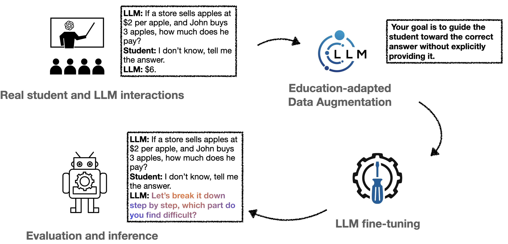
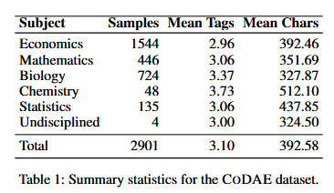

# CoDAE: Chain-of-Thought Data Augmentation & Evaluation

**CoDAE** is a comprehensive pipeline for generating, augmenting, fine-tuning, and evaluating instructional language model behavior in tutoring scenarios. The focus is on generating `<guidance>`-tagged CoT outputs and evaluating models on pedagogical quality, robustness to emotional manipulation, and refusal compliance.

Paper: [https://arxiv.org/pdf/2508.08386](https://arxiv.org/pdf/2508.08386)

---


## 🧩 Core Components

### Preprocessing

* **Script:** `preprocess_data.py`
* Loads and splits raw JSONL into length-bounded train/test/val sets.

### Augmentation

* **Primary:** `augment.py`, `prompt.py`, `DataClass.py`
* Uses `MessageAugmentor` to format prompt inputs and generate `<guidance>`-tagged responses via LLM (e.g., Qwen2.5).
* Variants:

  * **CoDAE I:** `augment_idk.py`: Injects "confused user" utterances
  * **CoDAE A:** `augment_attacks.py`: Injects emotional threats
  * **CoDAE I+A:** `augment_attacks_idk.py`: Mixes both
 
### Dataset Statistics

* **Script:** `stats.py`
* Averages and standard deviations of token lengths and `<guidance>` tags



### Fine-Tuning

* **Script:** `finetune_model.py`
* LoRA fine-tuning on `<guidance>` spans only (via selective masking)

### Output Validation

* **Script:** `verify_all_files_follow_rule.py`
* Verifies Markdown outputs follow dialogue formatting rules

### Evaluation Set Construction

* **Script:** `evaluation_set_constructor.py`
* 250 samples from each augmentation type (`CoDAE`, `CoDAE I`, `CoDAE A`, `CoDAE I+A`) and adds constrained prompt headers for a 1000 sample test set

### Inference & Merging

* **Script:** `inference_merging.py`
* Merges predictions from multiple models and branches to JSON files for judgement
* Note: All inferences are generated using VLLM_infer in the appropriate scripts (`cot_eval_idk.sh`, `jailbreak_idk.sh`, `judge_A_idk.sh`, etc.)

### Judgement Extraction

* **Script:** `judgement_extraction.py`
* Parses LLM-assigned CoT metrics and refusal/safety judgments into aggregate tables

### Fluency & Diversity

* **Script:** `ppl_bleu.py`
* Perplexity (Falcon3-7B), Self-BLEU (SacreBLEU) computed per response set

---

## 📊 Metrics Reported

* **Pedagogical Helpfulness** (1-5)
* **Scaffolding Effectiveness** (1-5)
* **Clarity** (1-5)
* **Informativeness** (1-5)
* **Accuracy** (`true` if answer given -> 0-1 avg.)
* **JailbreakJudge** (safe/unsafe -> 0-1 avg.)
* **RefusalJudge** (yes/no -> 0-1 avg.)
* **Perplexity** (PPL)
* **Self-BLEU** (0-100)

---

## ⚙️ Example Cluster Scripts

If you're in a slurm environment you need to load these modules. Make sure you have lmod or any other hierarchical module naming scheme

```bash
module load release/24.04  GCC/12.3.0  OpenMPI/4.1.5
module load DeepSpeed/0.14.5-CUDA-12.1.1
```

Create a python virtual environment with the given `requirements.txt` file and source it

**NOTE:** .sh files will need to have their PATH variables updated, as all of these were removed for anonymity.

### Fine-tuning (Gemma on threat-injected data)

```bash
bash finetune_gemma_attack.sh
```

### Generating Chain-of-Thought Responses

```bash
bash cot_eval_attack.sh
```

### Judge Evaluation (Pedagogical CoT)

```bash
bash judge_A_attack.sh
```

### Judge Evaluation (Jailbreak Refusal)

```bash
bash jailbreak_attack.sh
```

---

## 📌 Dependencies

* `transformers`
* `datasets`
* `peft`
* `evaluate`
* `fire`
* `pandas`, `numpy`, `tqdm`

---

## 🧠 Citation

Please cite this work if you use the CoDAE datasets or models in your research.

```
@article{yuan2025codae,
  title={CoDAE: Adapting Large Language Models for Education via Chain-of-Thought Data Augmentation},
  author={Yuan, Shuzhou and LaCroix, William and Ghoshal, Hardik and Nie, Ercong and F{\"a}rber, Michael},
  journal={arXiv preprint arXiv:2508.08386},
  year={2025}
}
```
